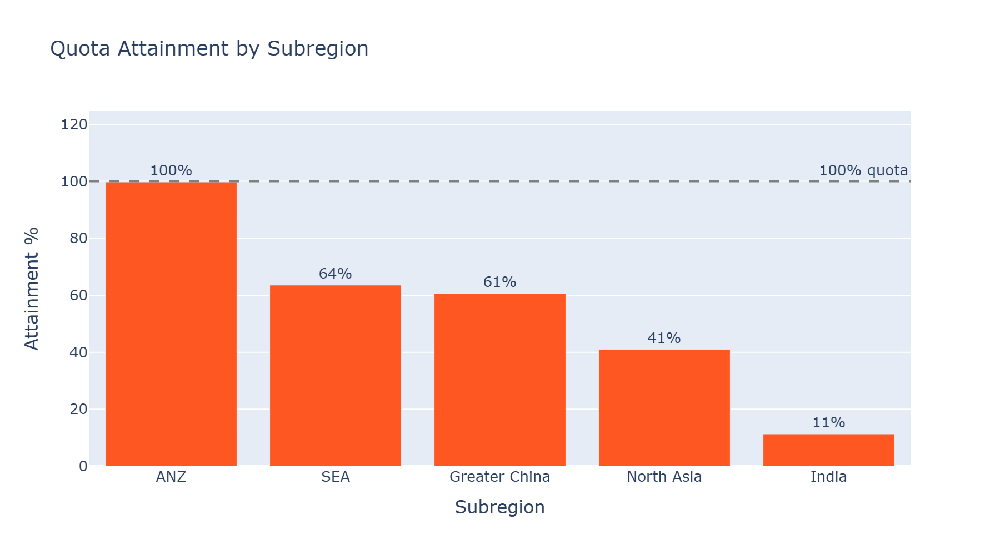
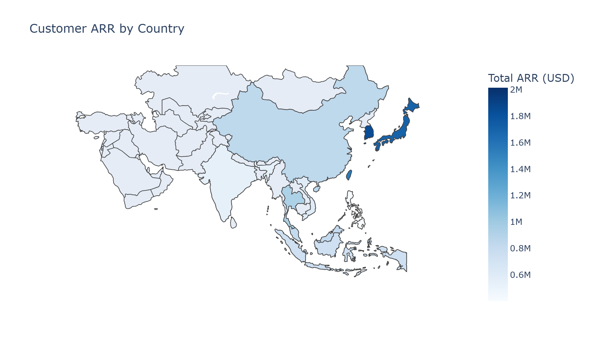
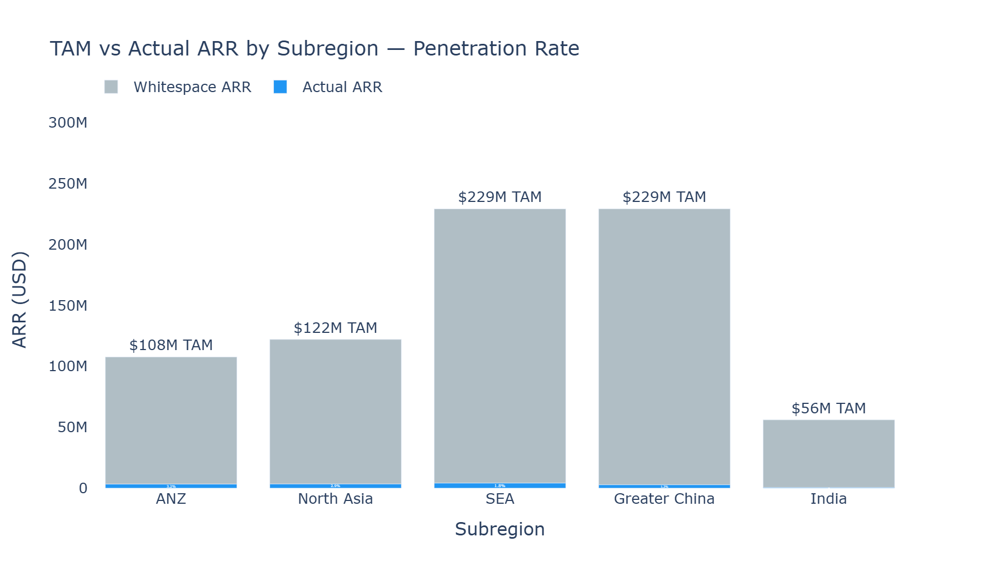
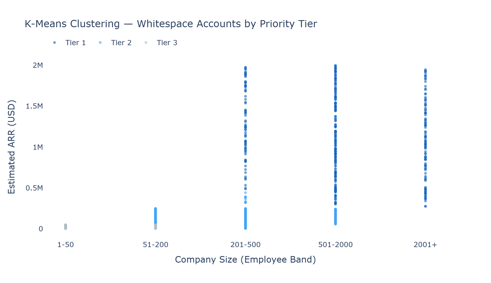
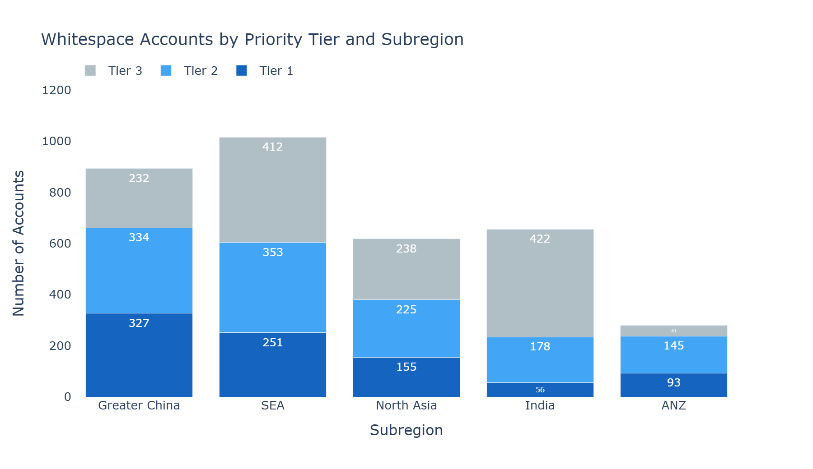
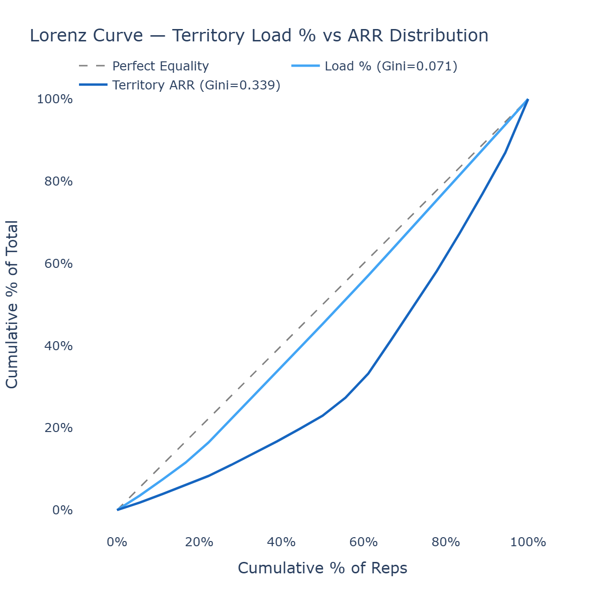
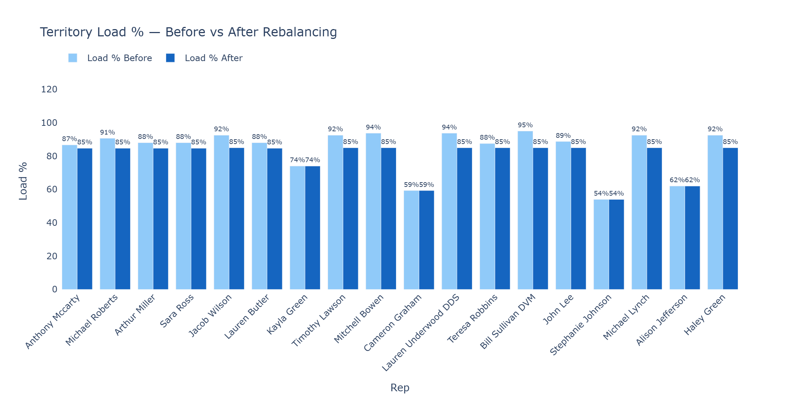
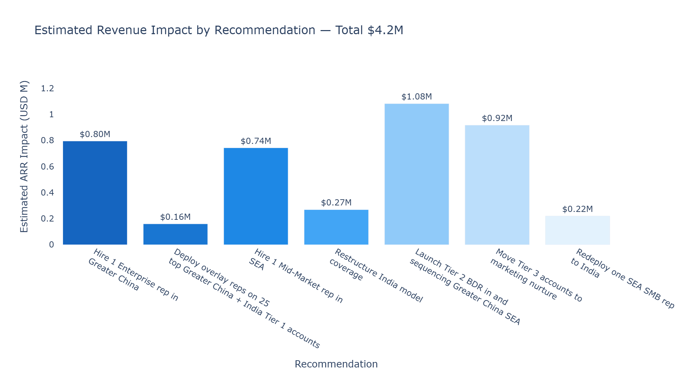

# APAC Territory Planning

**Role:** Revenue Operations Analyst  
**Stack:** Python · DuckDB · pandas · scikit-learn · Plotly  
**Data:** Synthetic · 2,000 accounts · 20 reps · 5 APAC subregions

---

## Portfolio Context

This is the fourth project in a RevOps analytics portfolio:

| Project | Objective | Key Technique |
|---|---|---|
| 1 · Customer Churn | Predict churn → save revenue | XGBoost, feature importance |
| 2 · Sales Pipeline | Visualise pipeline → close revenue | SQL window functions, Streamlit |
| 3 · SaaS Expansion | Predict expansion → grow revenue | Logistic regression, SHAP |
| **4 · Territory Planning** | **Plan territories → allocate resources** | **K-means, Gini coefficient** |

---

## Business Questions

1. Are APAC territories balanced by opportunity?
2. Which reps are over or under capacity?
3. Where is the whitespace — unassigned or never-touched accounts?
4. How should territories be realigned for next year?
5. What is the revenue impact of rebalancing?

---

## Key Findings

**Territory design is the problem, not headcount.**
Rep load is well distributed (Gini 0.071) but revenue opportunity is not (Gini 0.339). SMB reps hold $48-77M in territory ARR while Enterprise reps hold only $11-13M. Reps are working hard in the wrong places.

**$521M in whitespace ARR sits untouched.**
Less than 3.2% of TAM has been converted in any subregion. 300 priority accounts with avg ARR of $1.3M have been identified for immediate AE direct coverage.

**Greater China is the biggest single opportunity.**
124 Tier 1 Enterprise accounts, $146M ARR potential — largely untouched with only 4 reps covering 480 accounts.

**India needs a different playbook.**
India reps are at 54-62% capacity but have the lowest attainment in APAC (6-16%). The market is SMB-heavy with $16K avg ARR — direct rep coverage is not cost-effective.

**Total estimated revenue impact: $4.2M**
Across 7 prioritised recommendations spanning new hires, overlay deployment, BDR sequencing, and rep redeployment.

---

## Recommended Actions

| Priority | Action | Impact | Timeframe |
|---|---|---|---|
| 1 | Hire 1 Enterprise rep — Greater China | $795K | Q1 next FY |
| 2 | Deploy overlay reps on top 25 Tier 1 accounts | $160K | Immediate |
| 3 | Hire 1 Mid-Market rep — SEA | $743K | Q1 next FY |
| 4 | Restructure India to BDR + marketing model | $269K | Q2 next FY |
| 5 | Launch Tier 2 BDR sequencing — Greater China + SEA | $1.1M | Q2 next FY |
| 6 | Move Tier 3 accounts to marketing nurture | $917K | Q2 next FY |
| 7 | Redeploy one SEA SMB rep to India | $220K | Q2 next FY |
| | **Total** | **$4.2M** | |

---

## Notebook Walkthrough

### 01 · Data Profiling
Schema validation, null checks, and distribution analysis across 5 tables. Establishes baseline coverage rates, rep capacity, and engagement status by subregion.

### 02 · Territory Performance
Quota attainment, pipeline coverage ratio, and win rate by rep and subregion using DuckDB SQL. Choropleth maps of customer ARR and open pipeline by country.




### 03 · Whitespace Analysis
Identifies 1,398 unworked accounts representing $521M ARR. K-means clustering (k=3, elbow method validated) segments whitespace into priority tiers. 300 priority accounts flagged for direct AE ownership.





### 04 · Territory Balancing
Gini coefficient analysis reveals load is equal (0.071) but ARR opportunity is not (0.339). Lorenz curve visualises the structural imbalance. Rebalancing simulation identifies 67 excess accounts and 234 mismatched accounts for reassignment.




### 05 · Recommendations
Prioritised action plan with data-driven revenue impact estimates. Conversion rates applied by coverage motion (direct rep, BDR, marketing nurture) based on observed data and B2B SaaS benchmarks. Executive memo for APAC sales leadership.



### 06 · SQL Analysis
All key metrics reproduced in pure SQL using chained CTEs — quota attainment, pipeline coverage, win rate, whitespace tiers — demonstrating full reproducibility without pandas transformations.

---

## Tech Stack

| Tool | Usage |
|---|---|
| Python 3.11 | Core analysis |
| DuckDB | In-memory SQL engine |
| pandas | Data wrangling |
| scikit-learn | K-means clustering, StandardScaler |
| Plotly | All charts and maps |
| scipy / numpy | Gini coefficient calculation |
| Faker | Synthetic data generation |
| Jupyter | Notebooks |
| Git | Version control |

---

## Domain Concepts Applied

| Concept | Definition | Used In |
|---|---|---|
| TAM | Total addressable market — revenue if all accounts converted | Notebook 03 |
| Penetration Rate | Current ARR / TAM × 100 | Notebook 03 |
| Whitespace | Unassigned or never-touched accounts | Notebooks 03-04 |
| Gini Coefficient | 0 = equal distribution, 1 = completely unequal | Notebook 04 |
| Lorenz Curve | Visual representation of Gini inequality | Notebook 04 |
| Coverage Ratio | Accounts assigned / rep capacity | Notebooks 01, 04 |
| Quota Attainment | Actual ARR / quota × 100 | Notebook 02 |
| Pipeline Coverage | Open pipeline / quota | Notebook 02 |
| K-means Clustering | Unsupervised ML — groups accounts into priority tiers | Notebook 03 |
| Elbow Method | Validates optimal number of clusters | Notebook 03 |

---

## How to Run

**1. Clone the repo**
```bash
git clone https://github.com/skyvisory/apac-territory-planning.git
cd apac-territory-planning
```

**2. Install dependencies**
```bash
pip install pandas duckdb scikit-learn plotly faker numpy scipy jupyter
```

**3. Generate synthetic data**
```bash
python scripts/generate_data.py
```

**4. Run notebooks in order**
```
notebooks/01_data_profiling.ipynb
notebooks/02_territory_performance.ipynb
notebooks/03_whitespace_analysis.ipynb
notebooks/04_territory_balancing.ipynb
notebooks/05_recommendations.ipynb
notebooks/06_sql_analysis.ipynb
```

---

## Project Structure
```
apac-territory-planning/
├── data/
│   └── raw/                  # Generated by scripts/generate_data.py
├── notebooks/                # Analysis notebooks 01-06
├── outputs/                  # Chart exports (PNG)
├── scripts/
│   └── generate_data.py      # Synthetic data generation
├── sql/                      # SQL query files
└── README.md
```

---

*Built as part of a RevOps / data analyst portfolio. Synthetic data only — no real company information.*